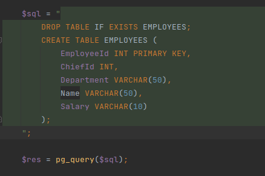

Я выполнил задачу с помощью Postgresql,докера контайнера, Php.

Сначала мы поднимем докера контайнера.Выдаем порт,имя БД,пароль БД.

``` 
sudo docker run --name some-postgres -e POSTGRES_PASSWORD=qwerty -e POSTGRES_DB=task_db -p 5432:5432 -d postgres
```

Открываем нашу программу на локальном хосте


Создание таблицы EMPLOYEES:



## 1. Напишите запрос для вывода списка сотрудников, у которых заработная плата выше,
чем у руководителя.

Запрос на вывод руководителей каждого отдела:

```
SELECT e.EmployeeId, e.Name, e.Salary, c.Name AS ChiefName, c.Salary AS ChiefSalary
            FROM EMPLOYEES e
            JOIN EMPLOYEES c ON e.ChiefId = c.EmployeeId
            WHERE e.Salary > c.Salary;
```


## 2. Напишите запрос для вывода списка названий отделов, где количество сотрудников не
превышает 3-х человек,

Запрос на вывод отделов с количеством сотрудников не более 3:

```
SELECT Department, COUNT(*) AS EmployeeCount
            FROM EMPLOYEES
            GROUP BY Department
            HAVING COUNT(*) <= 3;
```

## 3. Определите форму нормализации данной таблицы.

Исходная таблица содержит повторяющуюся информацию, например, один и тот же руководитель может быть указан для нескольких сотрудников. Также есть повторяющиеся названия отделов и одинаковые зарплаты. 
Для нормализации таблицы можно использовать следующие шаги:
a) Создание отдельной таблицы для сотрудников:
Table: Employees
Columns: EmployeeId (Primary Key), Name, Salary, DepartmentId (Foreign Key), ChiefId (Foreign Key)

b) Создание отдельной таблицы для отделов:
Table: Departments
Columns: DepartmentId (Primary Key), DepartmentName

c) Создание отдельной таблицы для руководителей:
Table: Chiefs
Columns: ChiefId (Primary Key), ChiefName, ChiefSalary

d) В таблице Employees использовать столбец DepartmentId для связи с таблицей Departments и столбец ChiefId для связи с таблицей Chiefs.