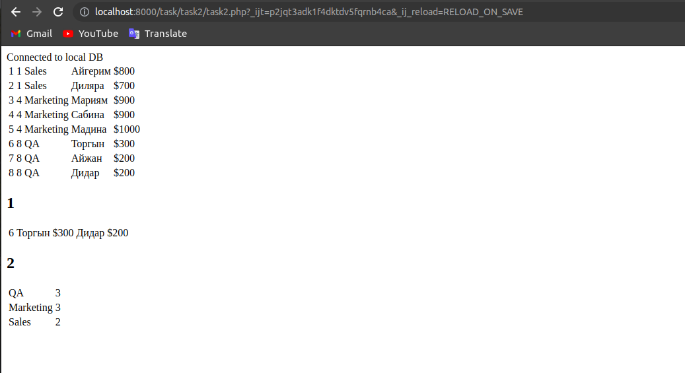

Я выполнил задачу с помощью Postgresql,докера контайнера, Php.

Сначала мы поднимем докера контайнера.Выдаем порт,имя БД,пароль БД.

``` 
sudo docker run --name some-postgres -e POSTGRES_PASSWORD=qwerty -e POSTGRES_DB=task_db -p 5432:5432 -d postgres
```

Открываем нашу программу на локальном хосте




